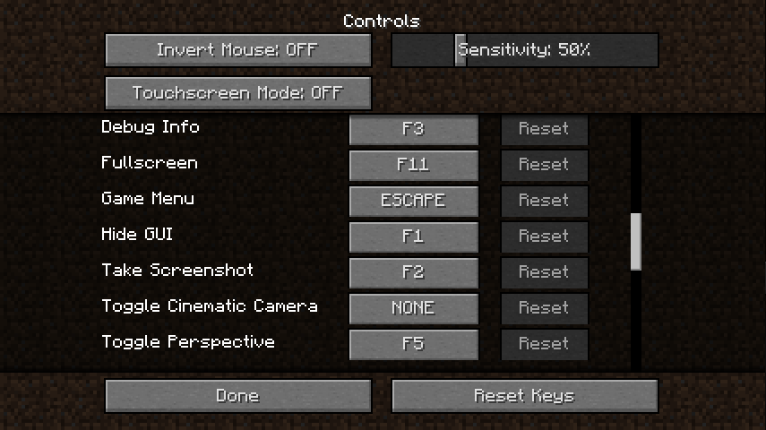
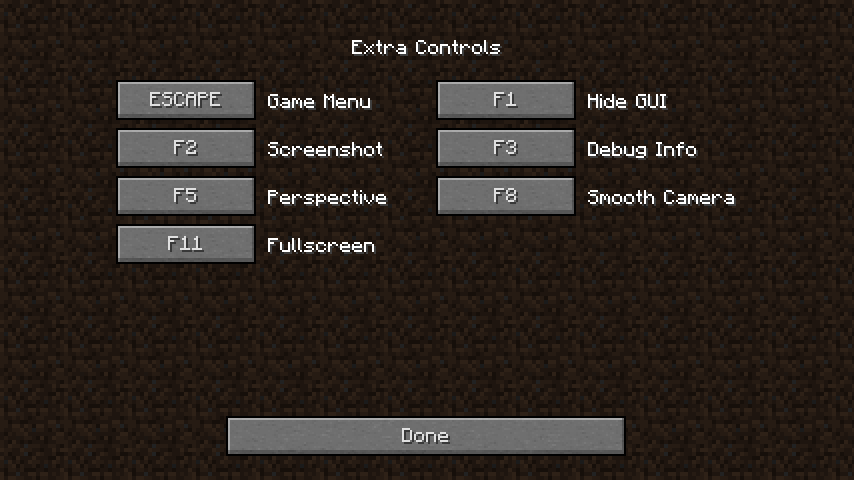

# Thorough Keybindings

For as many Minecraft versions as possible, makes the keybindings of usually
fixed mappings rebindable.
For example, this lets you remap F3 or Esc in-game, without external software.
Also adds rebinding options to earlier game versions, like rebinding F5 or
hotbar slot keys.

## Screenshots

